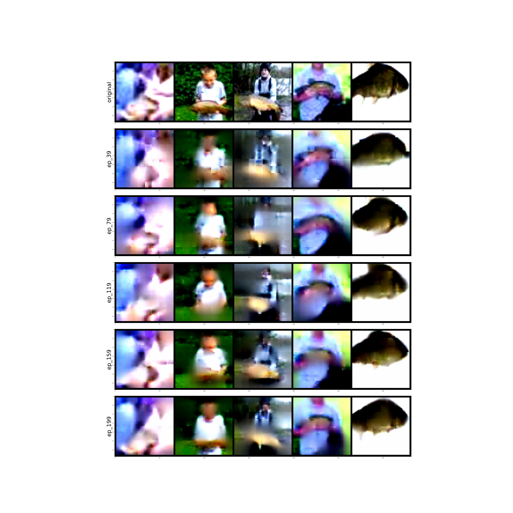

# MAE模型复现

使用https://github.com/PatrickHua/SimpleMAE做的简单MAE复现模型，使用该模型完成研究生课程作业。

为了训练速度快，在这里我使用了ImageNet的downsampled data中的64x64大小的图片进行训练了200轮，使用Data文件夹下的fix_pathes.py来转换成ImageFolder格式。

checkpoints文件夹已经包含我训练过程中保存的部分参数，configs文件夹中imagenet.yaml可以设置训练时的一些参数。

main.py训练文件，eval.py评估复原效果，transfer.py迁移学习

`python main.py --config=./configs/imagenet.yaml`

